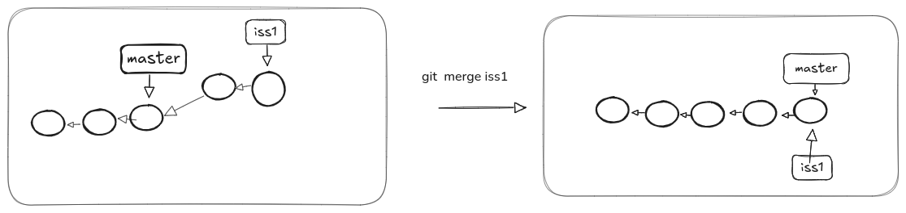

## Definitions
- **Root commit** -> initial comment
- **Branch** -> arrangements of comments By default(master)

## Configurations

To create config
```bash
git config --global user.name "hadeer"
git config --global user.email "hadeer"
git config --global core.editor "nano" # or add your Fav Text editor

# to see all config
git config --list
```

## Initializing Repo
```bash

git init #initialize repo, do it in folder to create a repo
# it creates .git directory, the place where git sotre all your commits and changes

```

## Commit
```bash
git status # status of files
git status -s # summarize status for every file
git add file.txt # add file to stage
git add <filename> # grouping files like this(*,f*,*txt) or using `.` to add all files

git commit -m "message" -> make version 
git commit -am "message" # TODO: Description
fit commit --amend # TODO: Description
```
## Undoing
```bash
git rm --cached fileName # TODO: Description

git restore filename # TODO: Description
git restore --staged file #to unstage file

git reset --soft <Hash> # TODO: Description

git reset  <Hash> # TODO: Description

git reflog # TODO: Description

```
## viewing History
```bash
git log # see history
git log --oneline # summarize each commit
git log --oneline file.txt # see commits for specific file
git log --oneline -n number # TODO: Description
git log --oneline --graph # list a clear path for every branch
git log --oneline --decorate --graph --all # TODO: Description
```

## differences
```bash
git diff # display changes of files (before stage)
git diff --staged # display changes of files(that are in stage area)

git diff SHA1..SHA1 # TODO: Description
gi diff SHA..HEAD # TODO: Description
git show SHA1 # TODO: Description

```

## Git Branching

```bash
git branch branchName # create new branch
git branch # to show branches
git switch branchName # move to the branch

# or you can use checkout to switch
git checkout branchName
git checkout -b branchName <startPoint> # TODO: Description
```


## Merging
```bash
git merge branchName # merge branch, NOTE (you should be at branch that you to merge in)
```
- There is three types of Merging based on changes that done in commit at both two branches.

**1. Fast Forward Merge**
 - it happens when there is no new commit in master (or what you merge in).
 - In this case, Git just move the master branch pointer to point to the last commit in other branch

 

```bash
git branch --merged # TODO: Description
git branch --no-merged # TODO: Description

git branch -d branchName # TODO: Description
```

## Three-Way Merge (Basic Merge)
- It’s called three ways, as Git does three things

1. ‌‌Finding the common ancestor of the two branches. This ancestor is called “merge base.”

2. Finding the last two snapshots.

3. Creating new commit that points to the last two snapshots

[check slide for more information..](https://docs.google.com/presentation/d/1mpdb6fSgZReAFC5PF6FTrt59MWpsgK1TAfSs-vu5480/edit#slide=id.g30d6f0d6b0a_4_15)

## Conflict merge
- If you changed the same part of the same file in the two branches you’re merging, Git won’t be able to merge them cleanly. It will leave this task for you! 

[check slide for more information and how to solve it..](https://docs.google.com/presentation/d/1mpdb6fSgZReAFC5PF6FTrt59MWpsgK1TAfSs-vu5480/edit#slide=id.g30d6f0d6b0a_4_27)


## Working With Remote

##### Clone
Take a copy from original project directly into your local machine, then push or pull(fetch)

```bash
git clone url fileName 
git remote add <url> writeName # adding more than one remote in your local repository

git remote # TODO: Description
git remote -v # TODO: Description
git branch -r # TODO: Description
```
##### Tracking Remote Branches
```bash
git fetch # first get updates
git checkout --track remoteName/branchName # track branch

```
### Getting Update

```bash
git fetch origin branchName # TODO: Description
git merge # TODO: Description

# Or Do
git pull # TODO: Description
```


### How make alias to help you
```bash
alias nameOfCommand="command"
alias graph="git log --online --all --graph --decorate"
```
